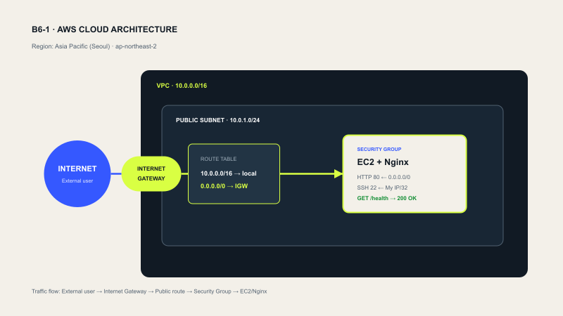

# B6-1 AWS Cloud Web Service

서울 리전의 사용자 정의 VPC와 Public Subnet에 EC2를 만들고, Nginx로 정적 웹사이트를 공개하는 프로젝트다.

## 현재 상태

- [x] 로컬 웹사이트 구현
- [x] `/health` 엔드포인트 구현 (`200 OK`, 본문 `OK`)
- [x] EC2용 정적 빌드 및 Nginx 배포 설정
- [x] IAM 최소 권한 정책 초안
- [x] 트러블슈팅 및 정리 문서 템플릿
- [ ] AWS IAM 사용자/정책 적용
- [ ] VPC와 Public Subnet 생성
- [ ] EC2 생성 및 배포
- [ ] 외부 접속 증빙 캡처
- [ ] AWS 리소스 정리

## 로컬 실행

```bash
npm install
npm run dev
```

- 웹사이트: `http://localhost:3000`
- 헬스체크: `http://localhost:3000/health`

검증:

```bash
npm run verify
```

## AWS 아키텍처



| 리소스 | 값 |
|---|---|
| Region | `ap-northeast-2` |
| VPC | `cloud-lab-vpc` / `10.0.0.0/16` |
| Public Subnet | `cloud-lab-public-subnet` / `10.0.1.0/24` |
| Internet Gateway | `cloud-lab-igw` |
| Route Table | `cloud-lab-public-rt` |
| Security Group | `cloud-lab-web-sg` |
| EC2 | `cloud-lab-web` |

## 보안 규칙

| Type | Port | Source |
|---|---:|---|
| HTTP | TCP/80 | `0.0.0.0/0` |
| SSH | TCP/22 | 학습자 공인 IP `/32` |

- 전체 포트를 `0.0.0.0/0`에 허용하지 않는다.
- `AdministratorAccess`를 사용하지 않는다.
- 실습 정책은 [`infra/iam-policy.json`](infra/iam-policy.json)에 있다.

## EC2용 정적 빌드

```bash
npm run build:ec2
```

생성된 `out/` 폴더가 Nginx에 배포할 정적 사이트다.

EC2를 만든 뒤 한 번에 배포하려면 다음을 실행한다.

```bash
chmod 400 /path/to/cloud-lab-key.pem
./scripts/deploy-ec2.sh /path/to/cloud-lab-key.pem PUBLIC_IP
```

수동으로 진행할 경우 [`infra/nginx.conf`](infra/nginx.conf)를 EC2의 `/etc/nginx/sites-available/b6-cloud`에 적용하고, `out/` 내용을 `/var/www/b6-cloud/`로 복사한다.

## 외부 접속 검증

- 선택 방식: **B — GET `/health`**
- 검증 URL: `http://[PUBLIC_IP]/health`
- 기대 결과: `HTTP 200`, 본문 `OK`
- 실제 검증 일시: `[YYYY-MM-DD HH:MM KST]`

```bash
curl -i --connect-timeout 10 http://PUBLIC_IP/health
```

외부 접속 스크린샷은 `docs/screenshots/`에 저장한다. 리소스 정리 후 URL이 동작하지 않는 것은 정상이다.

## 제출 자료

- 아키텍처: [`docs/architecture.png`](docs/architecture.png)
- 트러블슈팅: [`docs/troubleshooting.md`](docs/troubleshooting.md)
- 정리 체크리스트: [`docs/cleanup-checklist.md`](docs/cleanup-checklist.md)
- 스크린샷: `docs/screenshots/`
