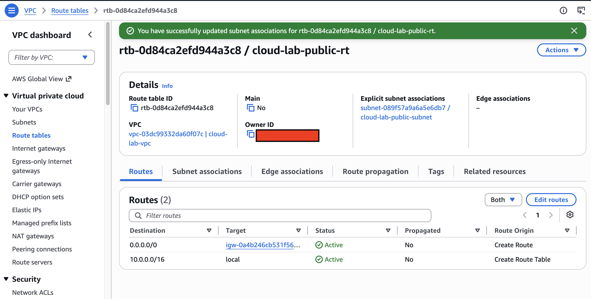
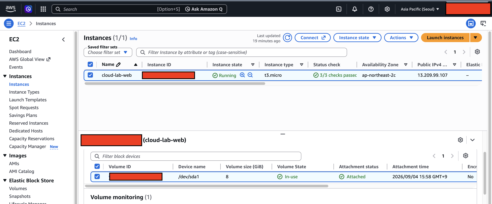
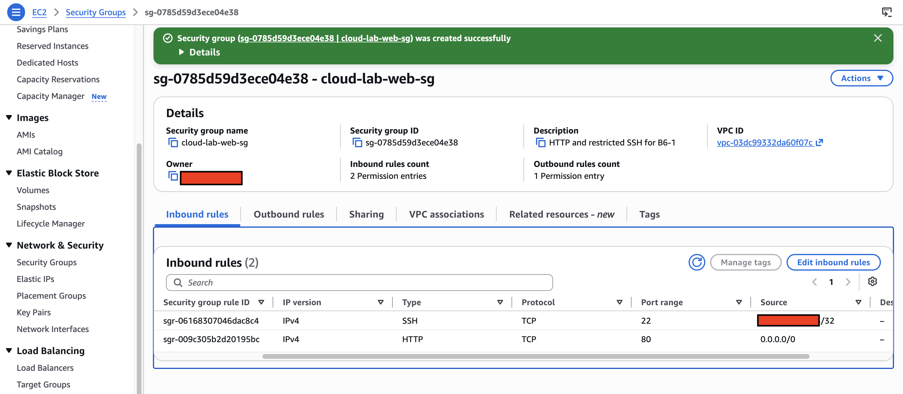
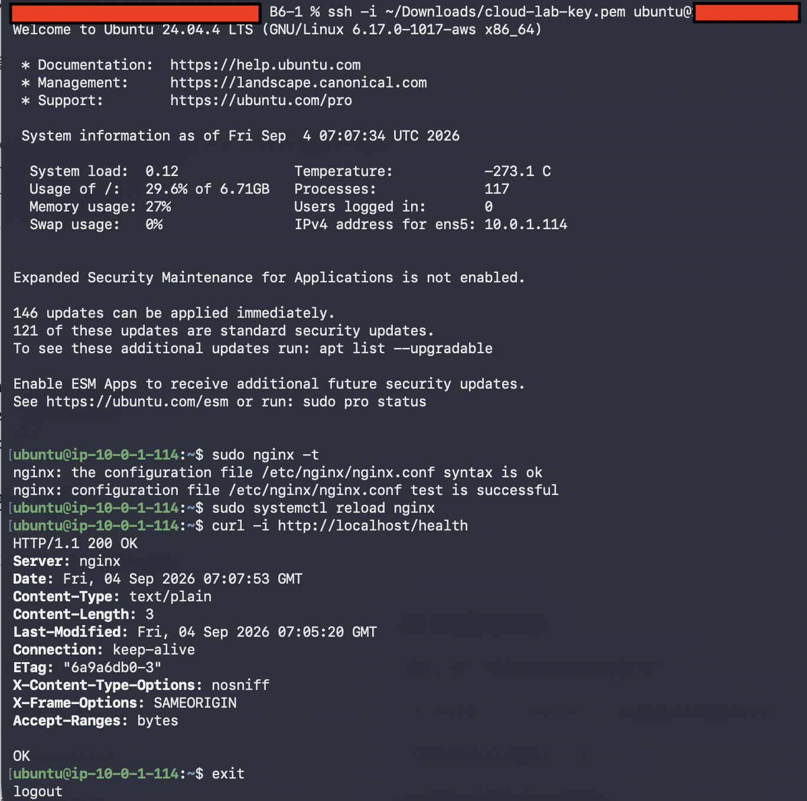
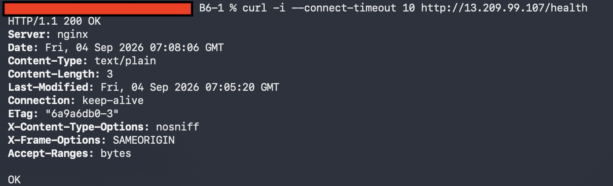
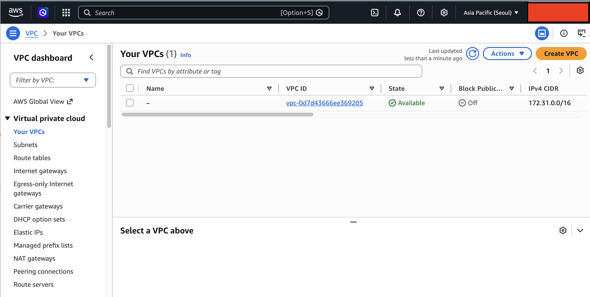
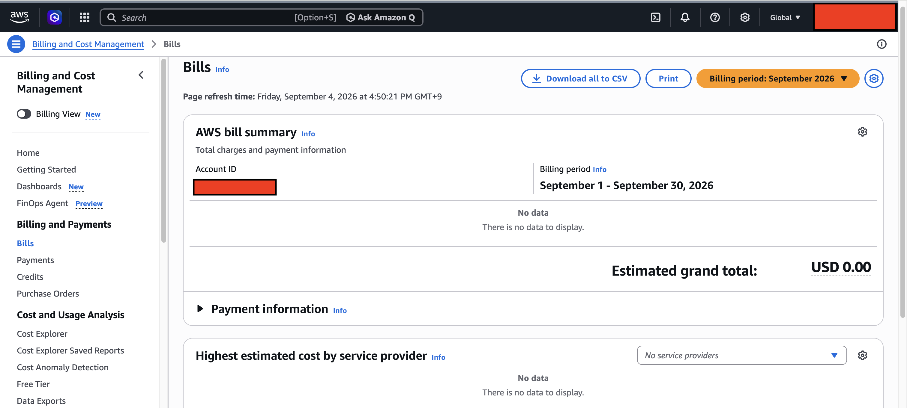

# B6-1 AWS Cloud Web Service

서울 리전의 사용자 정의 VPC와 Public Subnet에 EC2를 배치하고, Nginx로 정적 웹사이트를 외부에 공개한 프로젝트다. 네트워크 구성, 접근 제어, IAM 최소 권한, 장애 분석, 외부 검증과 리소스 정리까지 클라우드 서비스의 전체 생명주기를 직접 수행했다.

## 프로젝트 한눈에 설명

> 서울 리전(`ap-northeast-2`)에 `10.0.0.0/16` VPC와 `10.0.1.0/24` Public Subnet을 만들었다. Subnet의 Route Table에 `0.0.0.0/0 → Internet Gateway` 경로를 연결하고 Public IPv4를 가진 EC2에서 Nginx를 실행했다. Security Group은 외부 웹 접속을 위한 HTTP 80만 전체 공개하고, 관리용 SSH 22는 학습자 공인 IP `/32` 하나로 제한했다. 외부 Mac에서 `GET /health`를 호출해 `HTTP 200 / OK`를 확인했으며, 증빙을 저장한 뒤 EC2, EBS와 사용자 정의 VPC 리소스를 삭제하고 Billing이 `USD 0.00`인 것을 확인했다.

핵심 결과는 다음과 같다.

| 구분 | 실제 적용 결과 | 증빙 |
|---|---|---|
| Region | Asia Pacific (Seoul), `ap-northeast-2` | [`01-ec2-running.png`](docs/screenshots/01-ec2-running.png) |
| Network | VPC `10.0.0.0/16`, Public Subnet `10.0.1.0/24` | [`architecture.png`](docs/architecture.png) |
| Public route | `0.0.0.0/0 → Internet Gateway`, Subnet 명시적 연결 | [`02-route-table.png`](docs/screenshots/02-route-table.png) |
| Compute | Ubuntu 24.04 LTS, `t3.micro`, 8 GiB gp3 | [`01-ec2-running.png`](docs/screenshots/01-ec2-running.png) |
| Web server | Nginx, HTTP TCP/80 | [`04-local-health.png`](docs/screenshots/04-local-health.png) |
| Security Group | HTTP 80은 공개, SSH 22는 개인 IP `/32` | [`03-security-group.png`](docs/screenshots/03-security-group.png) |
| External check | 방식 B, `GET /health → HTTP 200 / OK` | [`05-external-health.png`](docs/screenshots/05-external-health.png) |
| Cleanup | 프로젝트 리소스 삭제, 예상 청구액 `USD 0.00` | [`06-cleanup.png`](docs/screenshots/06-cleanup.png), [`07-billing.png`](docs/screenshots/07-billing.png) |

## 1. 전체 아키텍처와 구성 요소


### 구성 요소별 역할

| 구성 요소 | 이 프로젝트에서의 역할 | 처음 배우는 사람을 위한 설명 |
|---|---|---|
| Region | 모든 실습 리소스를 서울에 배치 | AWS 데이터센터가 위치한 지리적 범위다. 리소스는 Region별로 분리되므로 생성·조회·삭제할 때 같은 Region을 확인해야 한다. |
| VPC | `10.0.0.0/16` 프로젝트 전용 네트워크 | AWS 안에 만드는 논리적으로 격리된 사설 네트워크다. IP 범위, Subnet, Route와 보안 경계를 직접 설계한다. |
| Public Subnet | `10.0.1.0/24` EC2 배치 구역 | Internet Gateway로 향하는 기본 경로를 가진 Subnet이다. EC2가 외부 통신을 하려면 Public Subnet뿐 아니라 Public IPv4도 필요하다. |
| Route Table | Subnet 트래픽의 목적지 결정 | 네트워크의 이정표다. VPC 내부 통신은 `local`, VPC 밖의 IPv4 트래픽은 `0.0.0.0/0 → IGW`로 보낸다. |
| Internet Gateway | VPC와 인터넷 연결 | VPC에 연결하는 인터넷 출입구다. 연결만으로는 충분하지 않고 Route Table, Public IPv4와 Security Group이 함께 올바르게 설정되어야 한다. |
| Public IPv4 | 인터넷에서 EC2를 식별하는 주소 | 외부 요청을 EC2의 사설 IP로 연결할 수 있게 한다. 이번 주소는 EC2 종료 시 반환되어 현재는 동작하지 않는다. |
| Security Group | EC2의 인바운드·아웃바운드 허용 규칙 | 인스턴스에 붙는 상태 저장형 가상 방화벽이다. 허용 규칙만 작성하며, 요청이 허용되면 그 응답 트래픽은 자동으로 허용된다. |
| EC2 | Ubuntu와 Nginx가 실행된 가상 서버 | AWS에서 빌려 사용하는 가상 컴퓨터다. 운영체제, 인스턴스 크기, 네트워크와 디스크를 선택해 생성한다. |
| EBS | EC2 운영체제와 웹 파일 저장 | EC2에 연결되는 영구 블록 스토리지다. 이번에는 8 GiB gp3 Root Volume을 사용하고 EC2 종료 시 함께 삭제되도록 설정했다. |
| Nginx | 정적 웹사이트와 `/health` 응답 제공 | TCP/80에서 HTTP 요청을 받고 `/var/www/b6-cloud`의 정적 파일을 반환하는 웹 서버다. |
| IAM | AWS 관리 작업의 권한 통제 | 누가 VPC나 EC2를 생성·조회·삭제할 수 있는지 결정한다. 웹사이트 방문자의 네트워크 접근을 제어하는 Security Group과 역할이 다르다. |

### 실제 리소스 구성

| 리소스 | 값 |
|---|---|
| Region | `ap-northeast-2` |
| VPC | `cloud-lab-vpc` / `10.0.0.0/16` |
| Public Subnet | `cloud-lab-public-subnet` / `10.0.1.0/24` |
| Internet Gateway | `cloud-lab-igw` |
| Route Table | `cloud-lab-public-rt` |
| Security Group | `cloud-lab-web-sg` |
| EC2 | `cloud-lab-web` |

## 2. 외부 요청이 EC2에 도달하는 흐름

외부 사용자가 `/health`를 호출하면 다음 흐름으로 요청이 이동한다.

```text
외부 사용자
  → EC2의 Public IPv4를 목적지로 요청
  → Internet Gateway의 Public/Private IPv4 연결
  → VPC 내부 경로와 Public Subnet
  → Security Group의 HTTP 80 허용 규칙
  → EC2의 Nginx
  → /health 파일의 "OK" 응답
```

각 단계가 모두 필요한 이유는 다음과 같다.

1. **Public IPv4**가 인터넷 요청의 목적지 역할을 한다.
2. **Internet Gateway**가 Public IPv4와 EC2의 Private IPv4 사이를 연결하고 VPC와 인터넷의 출입구 역할을 한다.
3. **Public Route Table**의 `0.0.0.0/0 → IGW`가 응답을 포함해 VPC 외부로 향하는 IPv4 트래픽의 출구를 지정한다.
4. **Subnet association**이 해당 Route Table을 EC2가 있는 Subnet에 실제로 적용한다.
5. **Security Group**의 TCP/80 규칙이 외부 HTTP 요청의 진입을 허용한다.
6. **Nginx 프로세스**가 포트 80에서 요청을 받아 실제 파일이나 응답을 반환한다.

`0.0.0.0/0`은 모든 IPv4 목적지를 의미한다. 외부에서 들어온 패킷은 Internet Gateway에서 EC2의 Private IPv4와 연결된 뒤 VPC 내부 경로로 전달되고, EC2가 보내는 응답과 아웃바운드 트래픽은 `0.0.0.0/0 → IGW` 경로를 사용한다. 이 기본 경로가 없으면 VPC 내부의 `10.0.0.0/16 → local` 통신은 가능하지만 인터넷 목적지로 나갈 수 없다. 따라서 Internet Gateway 연결, Route Table 경로, Subnet association, Public IPv4와 Security Group이 모두 필요하다.

EC2의 아웃바운드 인터넷 통신은 배포 과정에서 `apt-get update`와 Nginx 설치가 성공한 것으로 확인했다. 즉, EC2가 외부 패키지 저장소에 요청을 보내고 응답을 받을 수 있었다.

### Public Route Table 구성 증빙

아래 화면에서 `0.0.0.0/0 → Internet Gateway` 경로가 `Active`이고, `cloud-lab-public-subnet`이 명시적으로 연결된 것을 확인할 수 있다.



## 3. EC2와 Nginx 배포 구조

EC2는 Ubuntu Server 24.04 LTS, `t3.micro`, 8 GiB gp3 구성으로 생성했다. Public Subnet에 배치하고 자동 Public IPv4를 활성화했으며, 다운로드한 RSA `.pem` 키로 `ubuntu` 사용자에게 SSH 접속했다.

배포 과정은 다음과 같다.

1. Mac에서 Next.js 프로젝트를 정적 파일로 빌드한다.
2. `out/`의 결과물과 Nginx 설정을 SSH/SCP로 EC2에 전송한다.
3. EC2에 Nginx를 설치한다.
4. 정적 파일을 `/var/www/b6-cloud/`에 배치한다.
5. 기본 Nginx 사이트를 비활성화하고 프로젝트 설정을 활성화한다.
6. `nginx -t`로 문법을 검사하고 Nginx를 reload한다.
7. EC2 내부에서 `/health`를 호출해 `HTTP 200 / OK`를 확인한다.

배포 자동화는 [`scripts/deploy-ec2.sh`](scripts/deploy-ec2.sh), Nginx 설정은 [`infra/nginx.conf`](infra/nginx.conf)에 있다. `/health`의 고정 응답 파일은 [`public/health`](public/health)다.

```bash
chmod 400 /path/to/cloud-lab-key.pem
./scripts/deploy-ec2.sh /path/to/cloud-lab-key.pem PUBLIC_IP
```

SSH 성공은 단순히 포트 22가 열렸다는 뜻만이 아니다. Public IPv4, IGW 경로, SSH Security Group 규칙, 올바른 사용자 이름, 일치하는 Private Key가 모두 정상이라는 뜻이다. 웹 응답 성공은 여기에 Nginx 프로세스와 사이트 설정까지 정상이라는 것을 추가로 보여준다.

### EC2 실행 상태 증빙

아래 화면은 서울 리전에서 `cloud-lab-web` EC2가 `Running` 상태이고 상태 검사를 통과했으며 Public IPv4가 할당된 당시의 기록이다.



## 4. Security Group과 최소 노출 원칙

### 적용한 인바운드 규칙

| 용도 | Protocol/Port | Source | 선택 이유 |
|---|---|---|---|
| 웹 서비스 | TCP/80 | `0.0.0.0/0` | 누구나 웹 서비스의 HTTP 엔드포인트를 호출할 수 있어야 한다. |
| 서버 관리 | TCP/22 | 학습자 공인 IP `/32` | SSH는 관리자만 사용하므로 특정 IP 한 개로 제한한다. |

`/32`는 IPv4 주소 하나만 포함하는 CIDR 범위다. 네트워크나 VPN이 바뀌어 공인 IP가 변경되면 SSH 규칙도 현재 IP에 맞게 갱신해야 한다.

다음 규칙은 만들지 않았다.

- SSH 22를 `0.0.0.0/0`에 공개하는 규칙
- 모든 TCP 또는 전체 포트 `0-65535`를 공개하는 규칙
- 사용하지 않는 데이터베이스, 개발 서버 또는 관리 포트
- IPv6를 사용하지 않는 상태에서의 불필요한 `::/0` 규칙

SSH나 데이터베이스 포트를 전 세계에 공개하면 자동 스캔, 무차별 대입, 취약점 공격 대상이 된다. SSH는 개인 IP `/32`, VPN, Bastion Host 또는 AWS Systems Manager Session Manager로 제한할 수 있다. 데이터베이스는 Public Internet에 공개하지 않고 Private Subnet에 두며, 애플리케이션 EC2의 Security Group만 Source로 허용하는 방식이 안전하다.

### Security Group 규칙 증빙

아래 화면에서 HTTP 80은 `0.0.0.0/0`, SSH 22는 가려진 개인 공인 IP 한 개의 `/32`로 설정된 것을 확인할 수 있다.



## 5. Security Group과 IAM의 책임 분리

| 구분 | Security Group | IAM |
|---|---|---|
| 보호 대상 | EC2 등 리소스의 네트워크 인터페이스 | AWS 계정의 관리 API와 리소스 작업 |
| 판단 기준 | 출발지, Protocol, Port | 사용자/Role, Action, Resource, Condition |
| 이번 예시 | HTTP 80 공개, SSH 22 `/32` 제한 | EC2/VPC 작업만 허용하고 Region을 Seoul로 제한 |
| 막는 대상 | 허용되지 않은 네트워크 연결 | 권한 없는 생성·수정·삭제 요청 |

Security Group은 “누가 서버의 어느 포트에 연결할 수 있는가”를 통제한다. IAM은 “누가 AWS 콘솔이나 API에서 어떤 리소스 관리 작업을 할 수 있는가”를 통제한다. 따라서 IAM 권한을 추가해도 막힌 HTTP 포트가 열리지 않으며, Security Group을 수정해도 AWS 리소스 생성 권한이 생기지 않는다.

이번 실습의 사용자 정의 정책은 [`infra/iam-policy.json`](infra/iam-policy.json)에 기록했다.

- `AdministratorAccess`를 연결하지 않았다.
- EC2/VPC 구성에 필요한 생성·조회·태그·연결·삭제 Action만 허용했다.
- `aws:RequestedRegion` 조건으로 `ap-northeast-2`에서만 작업하도록 제한했다.
- 실습과 무관한 S3, RDS 등의 권한을 부여하지 않았다.
- 모든 VPC/EC2/Security Group 생성·검증·삭제 작업은 최소 권한 IAM 사용자로 수행했다. Root는 초기 계정 설정과 Billing 확인에만 사용했으며, 실습 리소스 작업에는 사용하지 않았다.

최소 권한은 현재 작업에 필요한 권한만 주는 원칙이다. 계정이 탈취되거나 명령을 잘못 실행하더라도 피해 범위를 줄일 수 있고, 실수로 다른 Region이나 무관한 서비스를 변경하는 것도 방지한다.

IAM 작업이 `AccessDenied`로 실패할 때는 관리자 권한을 바로 추가하지 않는다.

1. 오류 메시지에서 거부된 API Action과 대상 Resource를 확인한다.
2. CloudTrail Event history 또는 작업 화면의 오류 상세에서 실제 호출된 Action을 확인한다.
3. AWS Service Authorization Reference나 IAM Policy Simulator로 필요한 Action과 지원되는 Resource/Condition을 확인한다.
4. 기존 사용자 정의 정책에 필요한 Action 하나와 가능한 Resource·Region·Tag 조건만 추가한다.
5. 같은 작업을 다시 검증하고, 필요 이상으로 추가된 권한은 제거한다.

## 6. 외부 접속 검증 방식과 구성

외부 검증은 **방식 B — `GET /health`**를 선택했다. 브라우저 화면은 디자인이나 캐시 상태에 영향을 받을 수 있지만 `/health`는 고정된 짧은 응답과 HTTP 상태 코드로 서버 정상 여부를 명확하게 판단할 수 있다.

검증이 가능하도록 다음 요소를 구성했다.

- EC2에 Public IPv4 할당
- Public Subnet에 `0.0.0.0/0 → IGW` Route 적용
- Security Group에서 TCP/80을 `0.0.0.0/0`에 허용
- Nginx가 Port 80에서 요청을 수신
- `/health` 요청에 `public/health`의 `OK`를 반환

실제 검증 결과:

- 검증 URL: `http://13.209.99.107/health`
- 검증 일시: `2026-09-04 16:08 KST`
- 응답: `HTTP/1.1 200 OK`
- 본문: `OK`

```bash
curl -i --connect-timeout 10 http://13.209.99.107/health
```

### EC2 내부 검증 증빙

SSH로 EC2에 접속해 Nginx 설정을 검사하고 `http://localhost/health`가 `HTTP/1.1 200 OK`와 `OK`를 반환하는 것을 확인했다.



### 외부 접속 검증 증빙

Mac에서 당시 EC2 Public IPv4의 `/health`를 호출해 외부에서도 `HTTP/1.1 200 OK`와 `OK`가 반환되는 것을 확인했다.



증빙 저장 후 EC2를 종료했기 때문에 Public IPv4가 반환되었으며, 현재 이 URL이 동작하지 않는 것은 정상이다.

## 7. 이름·태그·체크리스트를 이용한 리소스 관리

실습 리소스를 쉽게 검색하고 안전하게 정리하기 위해 두 가지 기준을 사용했다.

### 일관된 이름

- VPC: `cloud-lab-vpc`
- Subnet: `cloud-lab-public-subnet`
- Internet Gateway: `cloud-lab-igw`
- Route Table: `cloud-lab-public-rt`
- Security Group: `cloud-lab-web-sg`
- EC2: `cloud-lab-web`
- Key Pair: `cloud-lab-key`

이름의 `cloud-lab` 접두어로 기본 AWS 리소스와 프로젝트 리소스를 구분했다.

### 공통 프로젝트 태그

생성한 리소스에는 `Project=B6-1` 태그를 적용했다. 태그는 리소스 검색, 프로젝트별 비용 분류, 자동화와 삭제 대상 확인에 사용할 수 있다. `Name` 태그는 사람이 콘솔에서 리소스를 알아보기 위한 이름이고, `Project` 태그는 여러 종류의 리소스를 하나의 프로젝트로 묶는 기준이다.

### 의존성을 고려한 정리 순서

```text
EC2 종료
  → EBS / Network Interface / Public IPv4 정리 확인
  → Security Group 삭제
  → Route Table 연결 해제 및 삭제
  → Internet Gateway 분리 및 삭제
  → Subnet 삭제
  → VPC 삭제
  → Key Pair 삭제
  → Billing 확인
```

상위 네트워크 리소스부터 먼저 삭제하면 연결된 하위 리소스 때문에 삭제가 거부될 수 있다. 따라서 EC2와 자동 생성된 Network Interface가 정리된 후 Security Group과 VPC 구성 요소를 역순으로 삭제했다.

[`docs/cleanup-checklist.md`](docs/cleanup-checklist.md)에서 다음 핵심 과금·정리 항목을 확인했다.

- EC2: `Terminated`
- EBS Volume: 남은 Volume 없음
- Elastic IP: 생성하지 않았고 자동 Public IPv4 반환
- Internet Gateway: VPC에서 Detach 후 삭제
- VPC/Subnet/Route Table/Security Group: 사용자 정의 리소스 삭제
- NAT Gateway, Load Balancer, RDS: 생성하지 않음
- Billing: 정리 직후 예상 청구액 `USD 0.00`

AWS 기본 VPC와 기본 구성 요소는 이번 프로젝트에서 만든 리소스가 아니므로 삭제하지 않았다. 사용자 정의 VPC가 사라지고 기본 VPC만 남은 화면을 아래에 기록했다.

### 사용자 정의 VPC 정리 증빙



## 8. 증상과 근거를 이용한 트러블슈팅

문제 해결은 설정을 무작정 바꾸는 대신 **증상 확인 → 원인 가설 → 검증 → 조치 → 재검증 → 재발 방지** 순서로 진행한다. 각 가설을 하나씩 확인해야 어떤 변경이 문제를 해결했는지 알 수 있고, 불필요한 보안 완화도 피할 수 있다.

### 실제 사례: 외부 `/health`의 404 응답

최초 외부 호출은 연결 시간 초과가 아니라 Nginx의 `HTTP/1.1 404 Not Found`를 반환했다. `Server: nginx/1.24.0 (Ubuntu)` 헤더가 있었기 때문에 요청은 이미 Public IPv4, IGW, Route Table, Security Group과 EC2까지 도달했다고 판단했다. 따라서 네트워크보다 Nginx 사이트 설정을 우선 조사했다.

검증과 조치에 사용한 명령은 다음과 같다.

```bash
sudo nginx -t
sudo systemctl reload nginx
curl -i http://localhost/health
```

원인은 Nginx가 설치 과정에서 기본 설정으로 이미 시작된 후, 새 사이트 설정을 적용하면서 reload되지 않은 것이었다. 설정 문법을 확인하고 Nginx를 reload하자 내부와 외부 모두 `HTTP 200 / OK`를 반환했다. 재발 방지를 위해 배포 스크립트에 `nginx -t`와 `systemctl reload nginx`를 포함했다.

전체 분석은 [`docs/troubleshooting.md`](docs/troubleshooting.md)에 기록했다.

### 외부 접속 실패의 점검 순서

```text
1. Routing
   → VPC/서브넷 확인
   → Route Table의 0.0.0.0/0 → IGW 확인
   → Subnet association과 IGW Attached 상태 확인

2. Security Group
   → 서비스 포트 80과 Source 확인
   → SSH 문제라면 현재 공인 IP /32 확인

3. Public address
   → EC2에 현재 Public IPv4 또는 Public DNS가 있는지 확인
   → Stop/Start 후 주소가 바뀌지 않았는지 확인

4. Server process
   → systemctl is-active nginx
   → sudo nginx -t
   → curl -i http://localhost/health

5. Logs and response evidence
   → sudo journalctl -u nginx --no-pager
   → sudo tail -n 100 /var/log/nginx/error.log
   → curl -i로 상태 코드와 Server 헤더 확인
```

오류 형태도 범위를 줄이는 근거가 된다.

| 증상 | 우선 의심할 영역 |
|---|---|
| Timeout | Route, IGW, Security Group, Public IPv4, Network ACL |
| Connection refused | 서버 프로세스 미실행 또는 해당 Port에서 listen하지 않음 |
| Nginx 404 | 네트워크는 도달했으며 Nginx 경로·사이트 설정·배포 파일 문제 |
| SSH `Permission denied (publickey)` | 사용자 이름, `.pem` 파일, Key Pair 일치 여부와 파일 권한 |

## 9. 두 대 이상의 EC2로 확장하는 구조

현재 구조는 EC2 한 대에 직접 접속하므로 구성이 단순하지만 다음 한계가 있다.

- EC2가 중단되면 서비스 전체가 중단되는 단일 장애점이 있다.
- 트래픽이 증가해 한 대의 CPU, Memory 또는 네트워크 용량을 넘으면 처리할 수 없다.
- 수동으로 두 번째 EC2를 만들어도 사용자가 어느 서버로 접속할지 분산할 장치가 없다.
- 현재 Public Subnet 하나만 사용하므로 하나의 Availability Zone 장애에 취약하다.

확장 시에는 다음 구조를 사용한다.

```text
Internet
  → Internet Gateway
  → Application Load Balancer
     ├─ Availability Zone A의 EC2
     └─ Availability Zone B의 EC2
```

필요한 변경은 다음과 같다.

1. 서로 다른 Availability Zone에 Subnet을 최소 두 개 구성한다.
2. Internet-facing Application Load Balancer(ALB)를 Public Subnet들에 배치한다.
3. EC2 두 대를 Target Group에 등록하고 `/health`로 상태를 검사한다.
4. 가능하면 Launch Template과 Auto Scaling Group으로 같은 설정의 EC2를 자동 생성·교체한다.
5. ALB Security Group만 HTTP/HTTPS를 인터넷에 공개한다.
6. EC2 Security Group은 ALB Security Group에서 오는 애플리케이션 Port만 허용한다.
7. SSH 직접 공개 대신 Systems Manager, VPN 또는 Bastion Host를 사용한다.
8. 여러 EC2가 같은 버전의 정적 파일을 갖도록 AMI, 배포 파이프라인 또는 S3/CloudFront 같은 공통 배포 방식을 사용한다.

ALB는 트래픽 분산과 비정상 인스턴스 제외를 담당한다. Auto Scaling Group은 수요에 따라 인스턴스 수를 조정하고 장애 인스턴스를 교체한다. EC2를 Private Subnet에 배치하면 직접 인터넷 노출을 줄일 수 있지만, 패키지 설치 같은 아웃바운드 통신에는 NAT Gateway 등이 필요할 수 있고 추가 비용이 발생한다.

## 10. 예상하지 못한 비용의 추적과 정리

Billing에 예상하지 못한 비용이 나타나면 금액만 확인하지 않고 **서비스 → Region → 사용 유형 → 실제 리소스** 순서로 추적한다.

1. Billing의 **Bills → Charges by service**에서 비용을 발생시킨 서비스와 Region을 확인한다.
2. Cost Explorer에서 날짜, Service, Region, Usage type으로 범위를 좁힌다.
3. `Project=B6-1` 태그와 `cloud-lab-*` 이름으로 관련 리소스를 검색한다.
4. 과금 가능성이 높은 EC2 Running 상태, EBS Volume/Snapshot, Public IPv4, Elastic IP, NAT Gateway, Load Balancer와 RDS를 우선 확인한다.
5. 연결 관계를 확인한 뒤 사용하지 않는 리소스를 안전한 의존성 순서로 삭제하거나 Release한다.
6. Billing은 반영이 지연될 수 있으므로 삭제 직후와 다음 날 같은 Billing period를 다시 확인한다.

EC2를 Stop해도 연결된 EBS나 일부 네트워크 리소스 비용은 남을 수 있다. Elastic IP, NAT Gateway, Load Balancer와 RDS도 별도 과금 항목이므로 EC2 화면만 보고 정리가 끝났다고 판단하지 않는다.

이번 실습에서는 증빙 저장 후 프로젝트 리소스를 모두 삭제했으며, `2026-09-04 16:50 KST`의 예상 청구액이 `USD 0.00`인 것을 확인했다.

### Billing 확인 증빙



## 11. 로컬 실행과 검증

```bash
npm install
npm run dev
```

- 웹사이트: `http://localhost:3000`
- 헬스체크: `http://localhost:3000/health`

실행 중인 개발 서버를 검증한다.

```bash
npm run verify
```

개발 서버 없이 EC2용 정적 결과물을 빌드하고 `/`와 `/health`를 함께 검증한다.

```bash
npm run verify:ec2
```

성공 기준은 다음과 같다.

```text
Home page: OK
Health endpoint: 200 OK (OK)
EC2 static package: READY (out/)
```

## 12. 제출 자료

- 아키텍처 다이어그램: [`docs/architecture.png`](docs/architecture.png)
- 외부 접속 증빙: [`docs/screenshots/05-external-health.png`](docs/screenshots/05-external-health.png)
- 트러블슈팅 보고서: [`docs/troubleshooting.md`](docs/troubleshooting.md)
- 리소스 정리 체크리스트: [`docs/cleanup-checklist.md`](docs/cleanup-checklist.md)
- AWS 배포 실행서: [`docs/aws-deployment-runbook.md`](docs/aws-deployment-runbook.md)
- 전체 증빙 목록: [`docs/screenshots/README.md`](docs/screenshots/README.md)

개인 IAM 사용자 이름, 로컬 경로와 키 위치는 GitHub에 올리지 않고 `.gitignore`에 등록된 `docs/aws-deployment-runbook-local.md`에서만 관리한다.
